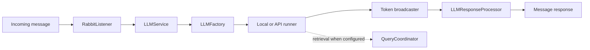

# Request Architecture

## Summary

A request enters through the message listener, is routed through the LLM
service and factory to an appropriate runner, then model output is parsed and
published through the response processor.

## Details

The runner can request an expert tool. The response path handles streaming
chunks, function-call tracking, errors, and result publication. Retrieval can
inject query results into chat history before the result is returned.

## Relationships

- [components/llm-factory](https://github.com/Mungert69/NetworkMonitorLLM/wiki/llm-factory) owns runner selection and session coordination.
- [components/tool-builders](https://github.com/Mungert69/NetworkMonitorLLM/wiki/tool-builders) supplies prompt and tool definitions.
- [concepts/tool-calling](https://github.com/Mungert69/NetworkMonitorLLM/wiki/tool-calling) describes supported output formats.

## Sources

- [sources/repository-overview](https://github.com/Mungert69/NetworkMonitorLLM/wiki/repository-overview)
