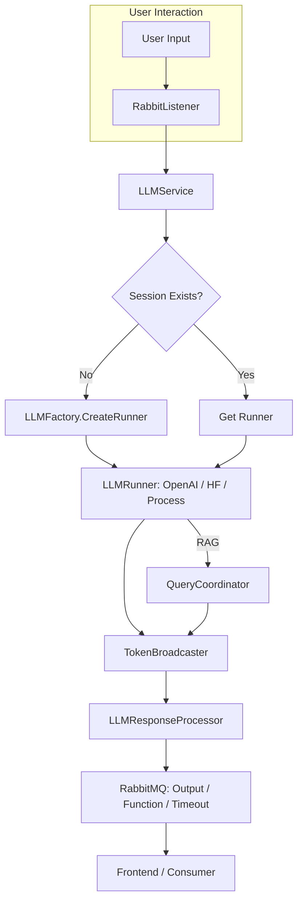

---

# High-Level Purpose

This codebase implements a **modular**, **multi-backend** Large Language Model (LLM) orchestration and chat system, designed for **network monitoring**, **security**, and **automation** tasks. It supports:

* Multiple LLM providers (OpenAI, HuggingFace, local LLMs via `llama.cpp`, etc.)
* Function/tool calling
* Session management
* Integration with a message queue (RabbitMQ) for distributed operation

---

# Key Components and Flow

## 1. Session and Message Handling

* **`RabbitListener`**:
  Listens to RabbitMQ for incoming session start, user input, stop, and query result messages. It dispatches these to the LLM service layer.

* **`LLMService`**:
  Manages sessions, starts/stops LLM runners, routes user input to the correct LLM instance, and handles session history and result messaging.

## 2. LLM Runners and Factories

* **`LLMFactory`**:
  Creates and manages different types of LLM runners (OpenAI, HuggingFace, local/test LLMs), manages session histories, and handles load balancing.

* **`LLMProcessRunner`**:
  Manages local LLM processes (e.g., `llama.cpp`), including process lifecycle, input/output handling, and token broadcasting.

* **`OpenAIRunner`**:
  Handles OpenAI and HuggingFace chat completions (via flag), function/tool calls, and session history.

## 3. Function/Tool Calling

* **`ToolsBuilderBase` & Derived Builders**:
  Define tools/functions for expert domains like Security, Penetration, Quantum, Search, CmdProcessor, etc., including their parameters and system prompts.

* **`TokenBroadcasterBase` & Derived**:
  Parses LLM output for function calls (JSON or XML), sanitizes/repairs output, and broadcasts tokens/chunks to the response processor.

## 4. Response Processing

* **`LLMResponseProcessor`**:
  Handles LLM output, function call tracking, chunked output, error handling, and publishes results to RabbitMQ.

## 5. RAG (Retrieval-Augmented Generation) Integration

* **`QueryCoordinator`**:
  Manages RAG queries, caching, and injecting results into chat history as system messages.

## 6. Resource Management

* **`CpuUsageMonitor`**:
  Monitors system CPU/memory and provides recommendations for local LLM resource allocation.

## 7. Audio Generation

* **`AudioGenerator`**:
  Converts LLM responses to audio using an external API, chunking long responses when needed.

---

# Typical Flow Diagram

---

# Key Features

* **Multi-LLM Support**: OpenAI, HuggingFace, and local LLMs
* **Function Calling**: Structured tool/function calls with robust parsing and error handling
* **Session Management**: Isolated history, state, and runner per session
* **RAG Integration**: Supports retrieval-augmented generation for context injection
* **Resource Awareness**: Adaptive to local system resource usage
* **Audio Output**: Optional text-to-speech response generation
* **Extensible Tools**: Easily add expert tools via builder classes

---

# Example Use Case

1. User sends a network scan request.
2. `RabbitListener` receives the message and forwards it to `LLMService`.
3. `LLMService` ensures a session/runner exists and routes input.
4. The runner (e.g., `OpenAIRunner`) builds a prompt and possibly calls a tool (e.g., `run_nmap`).
5. `TokenBroadcaster` parses the function call output.
6. `LLMResponseProcessor` tracks and completes the function call.
7. Results are sent back via RabbitMQ and optionally converted to audio.

---

# Extending the System

* **Add a new LLM**: Implement a new runner and register it in `LLMFactory`.
* **Add a new tool/expert**: Create a new `ToolsBuilder` and plug it into the relevant runner.
* **Add new message types**: Extend `RabbitListener` and `LLMService`.

---

# Summary

This codebase is a **robust**, **extensible** LLM orchestration platform for **network/security automation**, featuring:

* Multi-backend LLM support
* Advanced function calling
* Session isolation
* Distributed messaging via RabbitMQ
* Retrieval-augmented generation
* Audio output support

---

