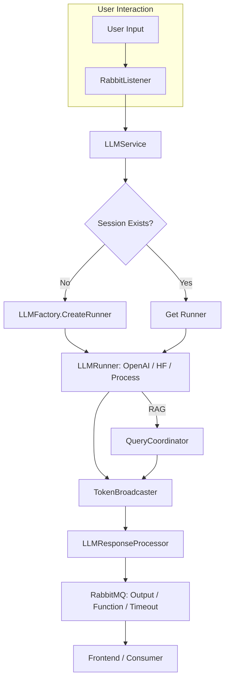

---

## NetworkMonitorLLM

# A Quantum Network Monitor Service Component

# High-Level Purpose

This codebase implements a **modular**, **multi-backend** Large Language Model (LLM) orchestration and chat system, designed for **network monitoring**, **security**, and **automation** tasks. It supports:

* Multiple LLM providers (OpenAI, HuggingFace, local LLMs via `llama.cpp`, etc.)
* Function/tool calling
* Session management
* Integration with a message queue (RabbitMQ) for distributed operation

---

# Key Components and Flow

## 1. Session and Message Handling

* **`RabbitListener`**:
  Listens to RabbitMQ for incoming session start, user input, stop, and query result messages. It dispatches these to the LLM service layer.

* **`LLMService`**:
  Manages sessions, starts/stops LLM runners, routes user input to the correct LLM instance, and handles session history and result messaging.

## 2. LLM Runners and Factories

* **`LLMFactory`**:
  Creates and manages different types of LLM runners (OpenAI, HuggingFace, local/test LLMs), manages session histories, and handles load balancing.

* **`LLMProcessRunner`**:
  Manages local LLM processes (e.g., `llama.cpp`), including process lifecycle, input/output handling, and token broadcasting.

* **`OpenAIRunner`**:
  Handles OpenAI and HuggingFace chat completions (via flag), function/tool calls, and session history.

---

# Model Selection and Provider Configuration

This service supports two main LLM modes that are selected per runner type and app settings:

## TurboLLM (OpenAI schema)

TurboLLM uses the OpenAI chat-completions schema via `OpenAIApi`.

Key settings:

```json
{
  "LlmUseHF": false,
  "LlmProvider": "OpenAI",
  "LlmGptModel": "gpt-5-mini",
  "LlmOpenAIThinking": "none",
  "GptModelVersion": "gpt",
  "OpenAIApiKey": ".env",
  "LlmOpenAIUrl": ""
}
```

Notes:

- If `LlmOpenAIUrl` is empty, the OpenAI SDK uses the default OpenAI base domain.
- If `LlmOpenAIUrl` is set, only its **base domain** is used (the path is ignored).
- `LlmOpenAIThinking` is sent as `reasoning_effort` on OpenAI-compatible
  chat-completions requests. Keep it at `none` for GPT Luna 5.6 when tool
  calling; use `LlmThinking` only for HugLLM/HuggingFace endpoints.

## HugLLM (HF JSON schema)

HugLLM uses the HuggingFace/OpenRouter JSON schema via `HuggingFaceApi`.

Key settings:

```json
{
  "LlmUseHF": true,
  "LlmHFModelID": "mistralai/devstral-2512:free",
  "LlmHFKey": ".env:OPENROUTER_API_KEY",
  "LlmHFUrl": "https://openrouter.ai/api/v1/chat/completions",
  "LlmHFModelVersion": "llama_3.2"
}
```

Notes:

- `LlmHFUrl` is used to derive the **base domain** for the HTTP client.
- `LlmHFModelID` must be a model ID accepted by the HF/OpenRouter endpoint.
- Set `LlmHFKey` to `.env:VARIABLE_NAME` to read any named secret from the
  configured `.env` file or process environment. `.env` remains supported and
  reads an environment variable named `LlmHFKey` for backwards compatibility.

## Provider Routing

Runner selection is fixed in code:

- `TurboLLM` → `OpenAIRunner(useHF=false)` → provider from `LlmProvider`
- `HugLLM` → `OpenAIRunner(useHF=true)` → provider forced to `HuggingFace`

The `LlmProvider` field supports:

```text
OpenAI | HuggingFace | OpenAIRabbit | HuggingFaceRabbit
```

`appsettings-eu-timesfm.json` currently uses `HuggingFaceRabbit` while the other EU configs use `OpenAI`.

## Tool Calling IDs

Some providers require short alphanumeric tool-call IDs. Configure:

```json
{
  "LlmToolCallIdLength": 9,
  "LlmToolCallIdPrefix": ""
}
```

If a provider rejects tool calls, set `LlmHfSupportsFunctionCalling: false` to fall back to JSON/XML parsing.

---

## 3. Function/Tool Calling

* **`ToolsBuilderBase` & Derived Builders**:
  Define tools/functions for expert domains like Security, Penetration, Quantum, Search, CmdProcessor, etc., including their parameters and system prompts.
  A dedicated Connect expert manages periodic connect types (not one-off commands) using `add_connect`, `delete_connect`, `get_connect_list`, and `get_connect_source_code`.

* **`TokenBroadcasterBase` & Derived**:
  Parses LLM output for function calls (JSON or XML), sanitizes/repairs output, and broadcasts tokens/chunks to the response processor.

### Function call formats (XML vs JSON)

The project supports two function-call output formats, toggled by `MLParams.XmlFunctionParsing`. This influences both the prompt footer (what the model is asked to emit) and the parsing path used for tool calls.

**XML format**
* The model is instructed to emit `<function_call name="..."><parameters>...</parameters></function_call>` blocks.
* Parsing is done by `TokenBroadcasterBase.ParseInputForXml`, which:
  * Extracts XML blocks with regex.
  * Converts the `<parameters>` XML to JSON (`SerializeXmlNode`) and adds `args_escaped=false`.
  * Returns `(json, functionName)` tuples.

**JSON format**
* The model is instructed to emit JSON tool-call objects or model-specific wrappers.
* Parsing is model-specific via `TokenBroadcaster*` classes (e.g., `TokenBroadcasterFunc_3_1`, `TokenBroadcasterFunc_3_2`, `TokenBroadcasterPhi_4`, `TokenBroadcasterGemma_3`, `TokenBroadcasterXlam2`, `TokenBroadcasterLFM_2`).
* These parsers extract function name + arguments and repair/sanitize JSON via `JsonSanitizer`.

**Where parsing is applied**
* For OpenAI responses, XML parsing is applied in `ChatResponseBuilder.BuildResponseFromOpenAI` when `XmlFunctionParsing=true`.
* For HuggingFace responses, `ChatResponseBuilder.BuildResponse` prefers structured tool calls if present; otherwise it falls back to XML/JSON parsing based on `XmlFunctionParsing`.

## 4. Response Processing

* **`LLMResponseProcessor`**:
  Handles LLM output, function call tracking, chunked output, error handling, and publishes results to RabbitMQ.

## 5. RAG (Retrieval-Augmented Generation) Integration

* **`QueryCoordinator`**:
  Manages RAG queries, caching, and injecting results into chat history as system messages.

## 6. Resource Management

* **`CpuUsageMonitor`**:
  Monitors system CPU/memory and provides recommendations for local LLM resource allocation.

## 7. Audio Generation

* **`AudioGenerator`**:
  Converts LLM responses to audio using an external API, chunking long responses when needed.

---

# Typical Flow Diagram


```mermaid
flowchart TD
    subgraph User Interaction
        A["User Input"] --> B["RabbitListener"]
    end
    B --> C["LLMService"]
    C --> D{"Session Exists?"}
    D -- No --> E["LLMFactory.CreateRunner"]
    D -- Yes --> F["Get Runner"]
    E & F --> G["LLMRunner: OpenAI / HF / Process"]
    G --> H["TokenBroadcaster"]
    H --> I["LLMResponseProcessor"]
    I --> J["RabbitMQ: Output / Function / Timeout"]
    J --> K["Frontend / Consumer"]
    G -->|RAG| L["QueryCoordinator"]
    L --> H
```

---

# Key Features

* **Multi-LLM Support**: OpenAI, HuggingFace, and local LLMs
* **Function Calling**: Structured tool/function calls with robust parsing and error handling
* **Session Management**: Isolated history, state, and runner per session
* **RAG Integration**: Supports retrieval-augmented generation for context injection
* **Resource Awareness**: Adaptive to local system resource usage
* **Audio Output**: Optional text-to-speech response generation
* **Extensible Tools**: Easily add expert tools via builder classes

---

# Example Use Case

1. User sends a network scan request.
2. `RabbitListener` receives the message and forwards it to `LLMService`.
3. `LLMService` ensures a session/runner exists and routes input.
4. The runner (e.g., `OpenAIRunner`) builds a prompt and possibly calls a tool (e.g., `run_nmap`).
5. `TokenBroadcaster` parses the function call output.
6. `LLMResponseProcessor` tracks and completes the function call.
7. Results are sent back via RabbitMQ and optionally converted to audio.

---

# Extending the System

* **Add a new LLM**: Implement a new runner and register it in `LLMFactory`.
* **Add a new tool/expert**: Create a new `ToolsBuilder` and plug it into the relevant runner.
* **Add new message types**: Extend `RabbitListener` and `LLMService`.

## Connect expert N-shot
The connect expert uses a separate N-shot flow to reflect periodic connect behavior and the `{ConnectType}Connect` class pattern.

---

# History Display Names

By default, history display payloads (`<history-display-name>...`) are only emitted by the user-facing service (defaults to `monitor`). You can override this in config:

```json
{
  "UserFacingServiceId": "monitor"
}
```

To request history display names for another service without changing the frontend, send a control message:

```
<|GET_HISTORY_DISPLAY|>cmdprocessor
```

If no service ID is provided, the server uses `UserFacingServiceId`.

---

# Agent Location in Prompts

Agent location is injected into prompts for the primary LLM:

- **OpenAI/HF runners**: the last location is inferred from history when available. If the current location is new (or the first seen), a one-time system message is appended before the next user message, e.g. “User changed agent location from A to B…”.
- **Local/Test runner**: a one-time system message is queued at session start with the initial agent location.

Only the primary LLM is auto-informed; experts receive the location only if the primary includes `agent_location` when calling them.

---

# Summary

This codebase is a **robust**, **extensible** LLM orchestration platform for **network/security automation**, featuring:

* Multi-backend LLM support
* Advanced function calling
* Session isolation
* Distributed messaging via RabbitMQ
* Retrieval-augmented generation
* Audio output support

---

# Building

* When building make sure to have the NetworkMonitorLib available. Copy NetworkMonitorLib repo to ../NetworkMonitorLib . [NetworkMonitorLib](https://github.com/Mungert69/NetworkMonitorLib/blob/main/README.md)

---

## 🚀 Live Demo and Examples

Explore real-world examples of the system in action:

- 🔬 **ReadyForQuantum Demo (Hugging Face Space)**  
  Interactive demo showcasing quantum-aware network analysis and LLM-driven diagnostics. Uses NetworkMonitorLLM instances to drive the LLM experts and assistants.  
  [https://huggingface.co/spaces/Mungert/ReadyForQuantum](https://huggingface.co/spaces/Mungert/ReadyForQuantum)

- 🌐 **Official Project Site**  
  The Full Quantum Network Monitor Service in action.  
  [https://readyforquantum.com/?utm_source=github&utm_medium=referral&utm_campaign=readme](https://readyforquantum.com/?utm_source=github&utm_medium=referral&utm_campaign=networkmonitorllm_readme)
